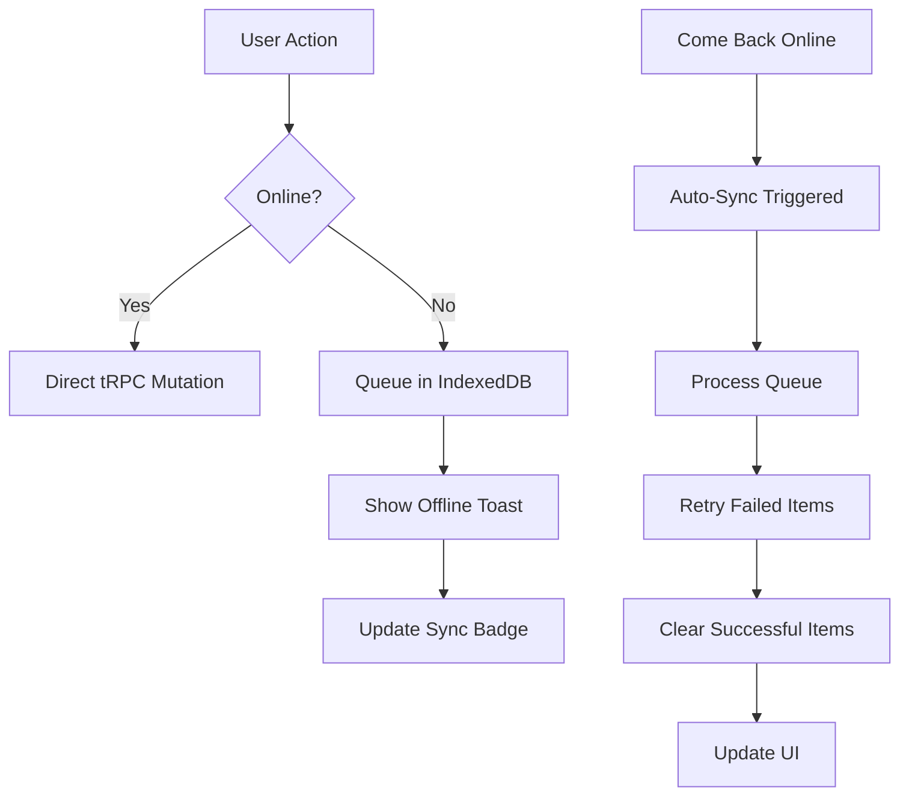

# Offline Queue Documentation

## Overview

The VetMed Tracker app includes a robust offline queue system that ensures medication administrations and inventory updates are never lost, even when users are working without an internet connection. This is critical for veterinary professionals who may be working in areas with poor connectivity or need to quickly record administrations without waiting for network requests.

## Architecture

### Core Components

1. **IndexedDB Storage** (`/lib/offline/db.ts`)
   - Persistent browser storage for offline mutations
   - Survives page reloads and browser restarts
   - Stores mutations with metadata for retry logic

2. **Offline Queue Hook** (`/hooks/useOfflineQueue.ts`)
   - React hook providing offline queue functionality
   - Manages online/offline detection
   - Handles automatic sync when coming back online
   - Provides UI state for sync progress

3. **Sync Status Component** (`/components/ui/sync-status.tsx`)
   - Visual indicator in the app header
   - Shows pending change count
   - Allows manual sync and queue management
   - Displays detailed queue information

### Data Flow



## Usage

### Basic Implementation

```typescript
import { useOfflineQueue } from "@/hooks/useOfflineQueue";
import { api } from "@/lib/trpc/client";

function MyComponent() {
  const { isOnline, enqueue } = useOfflineQueue();
  const createMutation = api.admin.create.useMutation();

  const handleSubmit = async (data: FormData) => {
    const payload = {
      animalId: data.animalId,
      regimenId: data.regimenId,
      // ... other fields
    };

    // Generate idempotency key to prevent duplicates
    const idempotencyKey = `${data.animalId}:${data.regimenId}:${Date.now()}`;

    if (!isOnline) {
      // Queue for later sync
      await enqueue("admin.create", payload, idempotencyKey);
      // Show success state to user
    } else {
      // Execute immediately
      await createMutation.mutateAsync(payload);
    }
  };
}
```

### Supported Mutations

The offline queue currently supports these tRPC mutations:

1. **admin.create** - Record medication administrations
2. **inventory.updateQuantity** - Update inventory quantities
3. **inventory.markAsInUse** - Mark inventory items as in use

### Adding New Mutations

To add support for a new mutation type:

1. Update the `QueuedMutation` type in `/lib/offline/db.ts`:
```typescript
export interface QueuedMutation {
  type: "admin.create" | "inventory.update" | "inventory.markAsInUse" | "your.newMutation";
  // ... other fields
}
```

2. Add the mutation handler in `/hooks/useOfflineQueue.ts`:
```typescript
const processMutation = async (mutation: QueuedMutation): Promise<void> => {
  switch (mutation.type) {
    // ... existing cases
    case "your.newMutation":
      await api.your.newMutation.mutate(mutation.payload);
      break;
  }
};
```

## Features

### Automatic Sync

When the app detects it's back online:
1. Shows "Back online - syncing changes" toast
2. Processes all queued mutations in order
3. Updates sync progress in real-time
4. Shows success/failure summary

### Retry Logic

Failed mutations are retried with exponential backoff:
- Initial retry after 1 second
- Second retry after 2 seconds
- Third retry after 4 seconds
- After 3 retries, the mutation is removed from queue

### Idempotency

All mutations use idempotency keys to prevent duplicate submissions:
- Admin records: `{animalId}:{regimenId}:{scheduledSlot}:{index}`
- Inventory updates: Custom keys based on operation

### Manual Sync Control

Users can:
- View pending changes by clicking the sync status icon
- Manually trigger sync with "Sync Now" button
- Clear the queue if needed (with confirmation)

### Progress Tracking

During sync, the UI shows:
- Current item being processed
- Total items to sync
- Progress bar
- Individual item status and retry count

## Error Handling

### Network Errors
- Automatically retried up to 3 times
- Error messages stored with each failed attempt
- User can see error details in the queue popup

### Validation Errors
- Not retried (as they won't succeed)
- Removed from queue after first attempt
- Error shown to user for manual resolution

### Conflict Resolution
- Idempotency keys prevent duplicate submissions
- Server returns existing record if already processed
- Client treats this as a successful sync

## Testing

### Unit Tests
See `/hooks/useOfflineQueue.test.ts` for:
- Queue operations (add, remove, update)
- Sync logic
- Retry behavior
- Error handling

### Integration Tests
See `/tests/integration/offline-sync.test.ts` for:
- Full offline/online flow
- Multiple queued items
- Partial sync failures
- Queue persistence

### E2E Tests
See `/tests/e2e/offline-pwa.spec.ts` for:
- Complete user workflows
- Service worker caching
- Network interruption handling
- UI state management

## Performance Considerations

### Storage Limits
- IndexedDB has browser-specific limits (usually 50MB+)
- Queue is scoped by household ID
- Old failed items are automatically cleaned up

### Sync Batching
- Mutations are processed sequentially to maintain order
- Failed items don't block successful ones
- Progress is saved after each successful mutation

### Memory Usage
- Queue details are loaded on-demand
- Large payloads are handled efficiently
- No memory leaks from event listeners

## Best Practices

1. **Always use idempotency keys** to prevent duplicate submissions
2. **Handle both online and offline cases** in your components
3. **Show appropriate feedback** to users about offline state
4. **Test offline scenarios** thoroughly
5. **Monitor queue size** and implement limits if needed
6. **Log sync failures** for debugging
7. **Validate data before queuing** to prevent validation errors later

## Troubleshooting

### Queue not syncing
1. Check browser console for errors
2. Verify online detection is working
3. Check if mutations are exceeding retry limit
4. Clear queue and try again

### Duplicate submissions
1. Verify idempotency keys are unique
2. Check server-side idempotency handling
3. Look for race conditions in sync logic

### Storage errors
1. Check IndexedDB quota in browser
2. Clear old data if needed
3. Implement storage management

### Performance issues
1. Limit queue size
2. Implement pagination for large queues
3. Optimize mutation payloads