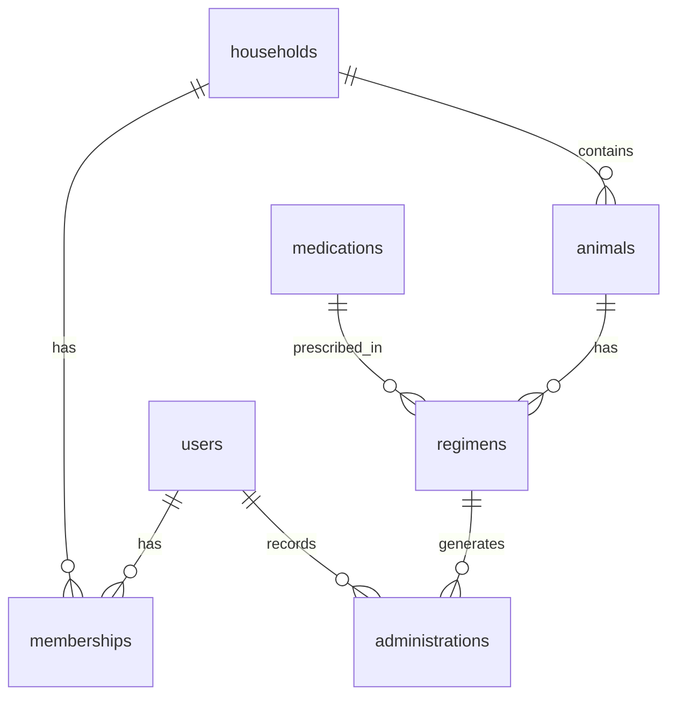

# Phase 6: Documentation & Deployment

**Duration**: Week 6  
**Priority**: HIGH  
**Dependencies**: All previous phases complete

## Overview

This final phase focuses on comprehensive documentation, deployment preparation, and launch readiness. The goal is to ensure smooth deployment, maintainability, and successful adoption of VetMed Tracker.

---

## 6.1 Technical Documentation

**Priority**: HIGH  
**Time Estimate**: 12 hours  
**Assignee**: Technical Writer + Development Team

### Objectives
- Create comprehensive developer documentation
- Document all APIs and data models
- Provide clear setup instructions
- Enable easy onboarding for new developers

### Tasks

#### API Documentation (4 hours)

**OpenAPI/Swagger Documentation**:

1. **tRPC Route Documentation**
   ```typescript
   // server/api/routers/_app.ts
   /**
    * @openapi
    * /api/admin/create:
    *   post:
    *     summary: Record medication administration
    *     tags: [Administration]
    *     security:
    *       - bearerAuth: []
    *     requestBody:
    *       required: true
    *       content:
    *         application/json:
    *           schema:
    *             type: object
    *             required:
    *               - animalId
    *               - regimenId
    *               - actualTime
    *             properties:
    *               animalId:
    *                 type: string
    *                 format: uuid
    *               regimenId:
    *                 type: string
    *                 format: uuid
    *               inventoryItemId:
    *                 type: string
    *                 format: uuid
    *                 nullable: true
    *               actualTime:
    *                 type: string
    *                 format: date-time
    *               notes:
    *                 type: string
    *                 maxLength: 500
    *     responses:
    *       200:
    *         description: Administration recorded successfully
    *       400:
    *         description: Invalid input data
    *       401:
    *         description: Unauthorized
    *       409:
    *         description: Duplicate administration (idempotency)
    */
   ```

2. **API Usage Examples**
   ```markdown
   # API Documentation
   
   ## Authentication
   
   All API requests require authentication via Bearer token:
   
   ```bash
   curl -H "Authorization: Bearer YOUR_TOKEN" \
        https://api.vetmed.app/api/admin/list
   ```
   
   ## Common Endpoints
   
   ### Record Medication
   POST /api/admin/create
   
   ```json
   {
     "animalId": "uuid",
     "regimenId": "uuid",
     "actualTime": "2024-01-15T10:30:00Z",
     "inventoryItemId": "uuid",
     "notes": "Given with food"
   }
   ```
   
   ### Get Administration History
   GET /api/admin/history?animalId=uuid&limit=50
   
   Response:
   ```json
   {
     "administrations": [
       {
         "id": "uuid",
         "animalName": "Buddy",
         "medicationName": "Amoxicillin",
         "status": "ON_TIME",
         "scheduledTime": "2024-01-15T10:00:00Z",
         "actualTime": "2024-01-15T10:05:00Z"
       }
     ],
     "pagination": {
       "total": 150,
       "page": 1,
       "limit": 50
     }
   }
   ```
   ```

#### Database Schema Documentation (3 hours)

**ERD and Schema Docs**:

```markdown
# Database Schema Documentation

## Core Tables

### users
Stores user account information
- `id` (uuid, PK): Unique user identifier
- `email` (varchar): User email (unique)
- `name` (varchar): Display name
- `createdAt` (timestamp): Account creation date

### households
Organization units for multi-tenancy
- `id` (uuid, PK): Unique household identifier
- `name` (varchar): Household name
- `timezone` (varchar): Default timezone
- `settings` (jsonb): Household preferences

### memberships
Many-to-many relationship between users and households
- `userId` (uuid, FK): References users.id
- `householdId` (uuid, FK): References households.id
- `role` (enum): OWNER | CAREGIVER | VETREADONLY
- `joinedAt` (timestamp): Membership start date

### animals
Pet/animal profiles
- `id` (uuid, PK): Unique animal identifier
- `householdId` (uuid, FK): References households.id
- `name` (varchar): Animal name
- `species` (varchar): Dog, Cat, etc.
- `breed` (varchar): Breed information
- `birthDate` (date): Date of birth
- `timezone` (varchar): Override timezone

### medications
Medication catalog
- `id` (uuid, PK): Unique medication identifier
- `genericName` (varchar): Generic drug name
- `brandNames` (text[]): Array of brand names
- `form` (enum): TABLET | LIQUID | INJECTION | TOPICAL
- `commonDosages` (jsonb): Standard dosing information

### regimens
Medication schedules
- `id` (uuid, PK): Unique regimen identifier
- `animalId` (uuid, FK): References animals.id
- `medicationId` (uuid, FK): References medications.id
- `name` (varchar): Regimen display name
- `dosage` (numeric): Amount per dose
- `unit` (varchar): mg, ml, etc.
- `frequency` (jsonb): Schedule configuration
- `startDate` (date): Regimen start
- `endDate` (date): Regimen end (nullable)

### administrations
Recorded medication events
- `id` (uuid, PK): Unique administration identifier
- `animalId` (uuid, FK): References animals.id
- `regimenId` (uuid, FK): References regimens.id
- `scheduledTime` (timestamp): When dose was due
- `actualTime` (timestamp): When dose was given
- `status` (enum): ON_TIME | LATE | VERY_LATE | MISSED | PRN
- `administeredBy` (uuid, FK): References users.id

## Indexes

```sql
-- Performance indexes
CREATE INDEX idx_administrations_lookup 
ON administrations(animal_id, scheduled_time DESC);

CREATE INDEX idx_regimens_active 
ON regimens(animal_id, start_date, end_date);

CREATE INDEX idx_inventory_household 
ON inventory_items(household_id, medication_id);
```

## Relationships Diagram


```

#### Developer Setup Guide (3 hours)

**Comprehensive README**:

```markdown
# VetMed Tracker Developer Guide

## Prerequisites

- Node.js 20.x or higher
- pnpm 10.x or higher
- PostgreSQL 15+ (or Neon account)
- Git

## Quick Start

1. **Clone the repository**
   ```bash
   git clone https://github.com/vetmed/tracker.git
   cd tracker
   ```

2. **Install dependencies**
   ```bash
   pnpm install
   ```

3. **Environment setup**
   ```bash
   cp .env.example .env.local
   # Edit .env.local with your values:
   # - DATABASE_URL: PostgreSQL connection string
   # - NEXT_PUBLIC_APP_URL: http://localhost:3000
   # - SESSION_SECRET: Generate with `openssl rand -base64 32`
   # - OPENAUTH_URL: https://auth.kajkowalski.nl
   ```

4. **Database setup**
   ```bash
   # Run migrations
   pnpm db:migrate
   
   # Seed demo data (optional)
   pnpm db:seed
   ```

5. **Start development server**
   ```bash
   pnpm dev
   ```

## Project Structure

```
├── app/                    # Next.js app router
│   ├── (authed)/          # Protected routes
│   ├── (dev)/             # Development tools
│   └── api/               # API routes
├── components/            # React components
│   ├── ui/               # Base UI components
│   ├── layout/           # Layout components
│   └── [feature]/        # Feature components
├── server/               # Backend code
│   ├── api/             # tRPC routers
│   ├── db/              # Database schema
│   └── services/        # Business logic
├── hooks/               # Custom React hooks
├── lib/                 # Utilities
└── public/              # Static assets
```

## Key Concepts

### Multi-Tenancy
- Data isolation by household
- Role-based access control
- Cross-household user support

### Offline-First
- Service worker caching
- IndexedDB queue
- Optimistic updates
- Conflict resolution

### Time Zones
- UTC storage
- Local display per animal
- DST handling
```

#### Architecture Decision Records (2 hours)

Create ADR documents for key decisions:

```markdown
# ADR-001: Multi-Tenancy via Household Model

## Status
Accepted

## Context
VetMed Tracker needs to support multiple organizational units (families, 
clinics, shelters) while allowing users to belong to multiple organizations.

## Decision
Implement multi-tenancy using a household-based model with:
- Household as the primary isolation boundary
- Many-to-many user-household relationships
- Role-based permissions per household
- Data filtering at the database level

## Consequences
- **Positive**: Flexible organization support, secure data isolation
- **Negative**: Complex permission checks, query complexity
- **Mitigation**: Middleware for automatic filtering, comprehensive testing
```

---

## 6.2 User Documentation

**Priority**: HIGH  
**Time Estimate**: 8 hours  
**Assignee**: Technical Writer + UX Designer

### Objectives
- Create user-friendly guides
- Provide video tutorials
- Build comprehensive FAQ
- Enable self-service support

### Tasks

#### User Guide Creation (4 hours)

**Table of Contents**:

1. **Getting Started Guide**
   ```markdown
   # Getting Started with VetMed Tracker
   
   ## Welcome!
   VetMed Tracker helps you manage medications for all your pets in one place.
   
   ## First Steps
   
   ### 1. Create Your Account
   - Visit [vetmed.app](https://vetmed.app)
   - Click "Sign Up"
   - Verify your email
   
   ### 2. Set Up Your Household
   - Name your household (e.g., "Smith Family")
   - Set your timezone
   - Invite family members (optional)
   
   ### 3. Add Your Pets
   - Click "Add Animal"
   - Enter pet details:
     - Name
     - Species (Dog, Cat, etc.)
     - Breed
     - Birth date
     - Weight
   
   ### 4. Create Medication Schedules
   - Go to "Regimens"
   - Click "Add Regimen"
   - Select your pet
   - Search for medication
   - Set schedule (e.g., twice daily)
   
   ### 5. Record Medications
   - From home screen, see what's due
   - Tap medication card
   - Hold button for 3 seconds
   - Success! Recorded with timestamp
   ```

2. **Feature Guides**
   - Recording medications (with screenshots)
   - Managing inventory
   - Setting up reminders
   - Generating vet reports
   - Using offline mode
   - Multi-caregiver coordination

3. **Troubleshooting**
   ```markdown
   ## Common Issues
   
   ### Can't record medication
   - Check internet connection
   - Verify you have caregiver permissions
   - Ensure medication schedule is active
   
   ### Reminder not working
   - Enable notifications in device settings
   - Check notification preferences in app
   - Verify schedule times are correct
   
   ### Offline sync issues
   - Ensure app stays open during sync
   - Check for sync conflicts
   - Manual sync: Settings > Sync Now
   ```

#### Video Tutorials (2 hours)

**Tutorial Scripts**:

1. **Quick Start (2 min)**
   - Account setup
   - Adding first pet
   - Recording first medication

2. **Daily Use (3 min)**
   - Morning routine
   - Handling late doses
   - Quick recording tips

3. **Advanced Features (5 min)**
   - Inventory management
   - Report generation
   - Multi-household setup

#### In-App Help System (2 hours)

**Interactive Help**:

```typescript
// components/help/help-widget.tsx
export function HelpWidget() {
  const [showHelp, setShowHelp] = useState(false);
  const { pathname } = useRouter();
  
  const contextualHelp = getHelpForPage(pathname);
  
  return (
    <>
      <Button
        variant="ghost"
        size="icon"
        className="fixed bottom-20 right-4"
        onClick={() => setShowHelp(true)}
      >
        <HelpCircle className="h-5 w-5" />
      </Button>
      
      <Sheet open={showHelp} onOpenChange={setShowHelp}>
        <SheetContent>
          <SheetHeader>
            <SheetTitle>Help & Support</SheetTitle>
          </SheetHeader>
          
          <div className="space-y-4 mt-4">
            {/* Contextual help for current page */}
            <Card>
              <CardHeader>
                <CardTitle className="text-base">
                  On This Page
                </CardTitle>
              </CardHeader>
              <CardContent>
                {contextualHelp.map(item => (
                  <HelpItem key={item.id} {...item} />
                ))}
              </CardContent>
            </Card>
            
            {/* Quick links */}
            <div className="space-y-2">
              <Button variant="outline" className="w-full justify-start">
                <Book className="mr-2 h-4 w-4" />
                User Guide
              </Button>
              <Button variant="outline" className="w-full justify-start">
                <Video className="mr-2 h-4 w-4" />
                Video Tutorials
              </Button>
              <Button variant="outline" className="w-full justify-start">
                <MessageSquare className="mr-2 h-4 w-4" />
                Contact Support
              </Button>
            </div>
          </div>
        </SheetContent>
      </Sheet>
    </>
  );
}
```

---

## 6.3 Deployment Preparation

**Priority**: CRITICAL  
**Time Estimate**: 10 hours  
**Assignee**: DevOps Engineer + Senior Developer

### Objectives
- Configure production environment
- Set up monitoring and alerts
- Implement backup strategies
- Ensure zero-downtime deployment

### Tasks

#### Infrastructure Setup (4 hours)

**Vercel Configuration**:

```json
// vercel.json
{
  "functions": {
    "app/api/**/*.ts": {
      "maxDuration": 10
    }
  },
  "rewrites": [
    {
      "source": "/sw.js",
      "destination": "/sw.js"
    }
  ],
  "headers": [
    {
      "source": "/(.*)",
      "headers": [
        {
          "key": "X-Content-Type-Options",
          "value": "nosniff"
        },
        {
          "key": "X-Frame-Options",
          "value": "DENY"
        },
        {
          "key": "X-XSS-Protection",
          "value": "1; mode=block"
        }
      ]
    }
  ]
}
```

**Environment Variables**:
```bash
# Production environment
DATABASE_URL=             # Neon PostgreSQL URL
NEXT_PUBLIC_APP_URL=      # https://vetmed.app
SESSION_SECRET=           # Strong random secret
OPENAUTH_URL=            # https://auth.kajkowalski.nl
OPENAUTH_CLIENT_ID=      # OAuth client ID
OPENAUTH_CLIENT_SECRET=  # OAuth client secret
SENTRY_DSN=              # Error tracking
UPSTASH_REDIS_URL=       # Rate limiting
UPSTASH_REDIS_TOKEN=     # Rate limiting auth
```

#### Monitoring Setup (3 hours)

**1. Error Tracking (Sentry)**:
```typescript
// app/layout.tsx
import * as Sentry from '@sentry/nextjs';

Sentry.init({
  dsn: process.env.SENTRY_DSN,
  environment: process.env.NODE_ENV,
  tracesSampleRate: 0.1,
  beforeSend(event) {
    // Sanitize sensitive data
    if (event.request?.cookies) {
      delete event.request.cookies;
    }
    return event;
  }
});
```

**2. Performance Monitoring**:
```typescript
// lib/monitoring/performance.ts
import { onCLS, onFID, onLCP, onFCP, onTTFB } from 'web-vitals';

export function reportWebVitals() {
  onCLS(sendToAnalytics);
  onFID(sendToAnalytics);
  onLCP(sendToAnalytics);
  onFCP(sendToAnalytics);
  onTTFB(sendToAnalytics);
}

function sendToAnalytics(metric: Metric) {
  // Send to your analytics service
  fetch('/api/analytics', {
    method: 'POST',
    body: JSON.stringify(metric),
    headers: { 'Content-Type': 'application/json' }
  });
}
```

**3. Uptime Monitoring**:
- Configure StatusPage or similar
- Monitor critical endpoints:
  - `/api/health` - Basic health check
  - `/api/admin/create` - Core functionality
  - `/api/auth/session` - Authentication

#### Backup Strategy (3 hours)

**Database Backups**:

1. **Automated Backups**
   ```typescript
   // scripts/backup-database.ts
   import { exec } from 'child_process';
   import { S3 } from '@aws-sdk/client-s3';
   
   export async function backupDatabase() {
     const timestamp = new Date().toISOString();
     const filename = `backup-${timestamp}.sql`;
     
     // Create backup
     await exec(`pg_dump ${process.env.DATABASE_URL} > ${filename}`);
     
     // Upload to S3
     const s3 = new S3();
     await s3.putObject({
       Bucket: 'vetmed-backups',
       Key: filename,
       Body: fs.createReadStream(filename)
     });
     
     // Clean up local file
     await fs.unlink(filename);
   }
   ```

2. **Backup Schedule**
   - Daily automated backups at 3 AM UTC
   - Weekly full backups with 30-day retention
   - Monthly archives with 1-year retention

3. **Disaster Recovery Plan**
   ```markdown
   # Disaster Recovery Playbook
   
   ## Database Failure
   1. Switch to read replica (if available)
   2. Restore from latest backup
   3. Replay transaction logs
   4. Verify data integrity
   
   ## Application Failure
   1. Rollback to previous version
   2. Restore from Git tag
   3. Redeploy via Vercel
   4. Run smoke tests
   ```

---

## 6.4 Launch Preparation

**Priority**: HIGH  
**Time Estimate**: 6 hours  
**Assignee**: Product Team + Marketing

### Objectives
- Prepare marketing materials
- Set up support channels
- Plan launch sequence
- Create feedback loops

### Tasks

#### Marketing Website (2 hours)

**Landing Page Sections**:

1. **Hero Section**
   ```tsx
   // app/(marketing)/page.tsx
   <section className="hero">
     <h1>Never Miss a Pet Medication Again</h1>
     <p>Simple, reliable medication tracking for pet parents</p>
     <div className="cta-buttons">
       <Button size="lg">Start Free Trial</Button>
       <Button variant="outline" size="lg">Watch Demo</Button>
     </div>
   </section>
   ```

2. **Feature Highlights**
   - Three-tap recording
   - Multi-pet support
   - Caregiver coordination
   - Vet reports
   - Offline support

3. **Pricing**
   ```markdown
   ## Simple, Transparent Pricing
   
   ### Free
   - 1 pet
   - Basic reminders
   - 30-day history
   
   ### Family ($4.99/month)
   - Unlimited pets
   - Advanced reminders
   - Full history
   - Vet reports
   - Priority support
   
   ### Clinic ($19.99/month)
   - Everything in Family
   - Multi-household
   - Team management
   - API access
   - Custom branding
   ```

#### Support Infrastructure (2 hours)

**Support Channels**:

1. **Help Center**
   - Knowledge base articles
   - Video tutorials
   - FAQ section
   - Contact form

2. **In-App Support**
   ```typescript
   // components/support/support-chat.tsx
   export function SupportChat() {
     return (
       <Script
         src="https://widget.intercom.io/widget/YOUR_APP_ID"
         strategy="lazyOnload"
         onLoad={() => {
           window.Intercom('boot', {
             app_id: 'YOUR_APP_ID',
             user_id: user?.id,
             email: user?.email,
             name: user?.name,
             custom_attributes: {
               household_id: household?.id,
               plan: subscription?.plan
             }
           });
         }}
       />
     );
   }
   ```

#### Launch Checklist (2 hours)

**Pre-Launch**:
- [ ] Production environment tested
- [ ] Monitoring alerts configured
- [ ] Support team trained
- [ ] Documentation published
- [ ] Legal terms updated
- [ ] Payment processing tested

**Launch Day**:
- [ ] Deploy to production
- [ ] Enable new user signups
- [ ] Announce on social media
- [ ] Send launch email
- [ ] Monitor performance
- [ ] Stand by for support

**Post-Launch**:
- [ ] Gather user feedback
- [ ] Monitor error rates
- [ ] Track adoption metrics
- [ ] Plan first updates
- [ ] Celebrate! 🎉

---

## Success Metrics

### Documentation Quality
- Developer onboarding time < 2 hours
- User guide completeness > 95%
- API documentation coverage 100%
- Video tutorial engagement > 70%

### Deployment Readiness
- Zero critical security issues
- Automated deployment pipeline
- Rollback capability < 5 minutes
- Monitoring coverage > 95%

### Launch Success
- First week retention > 80%
- Support ticket rate < 5%
- Performance SLA met > 99.9%
- User satisfaction > 4.5/5

---

## Phase 6 Checklist

### Documentation
- [ ] API documentation complete
- [ ] Database schema documented
- [ ] Developer guide written
- [ ] User guide published
- [ ] Video tutorials recorded
- [ ] In-app help implemented

### Infrastructure
- [ ] Production environment configured
- [ ] Monitoring tools setup
- [ ] Backup automation working
- [ ] Security headers configured
- [ ] SSL certificates valid

### Launch Preparation
- [ ] Marketing website live
- [ ] Support channels ready
- [ ] Legal documents updated
- [ ] Payment processing tested
- [ ] Launch plan communicated

### Final Verification
- [ ] All tests passing
- [ ] Security audit clean
- [ ] Performance targets met
- [ ] Documentation reviewed
- [ ] Team trained

### Sign-off
- [ ] Technical approval
- [ ] Product approval
- [ ] Legal approval
- [ ] Ready to launch! 🚀

---

## Post-Launch Roadmap

### Week 1-2: Stabilization
- Monitor performance
- Fix critical bugs
- Gather feedback
- Optimize based on usage

### Month 1: Enhancement
- Feature requests
- Performance tuning
- Mobile app planning
- Integration partners

### Quarter 1: Growth
- Marketing campaigns
- Feature expansion
- Platform scaling
- Team growth

### Year 1: Vision
- Multi-platform apps
- AI insights
- Vet partnerships
- International expansion